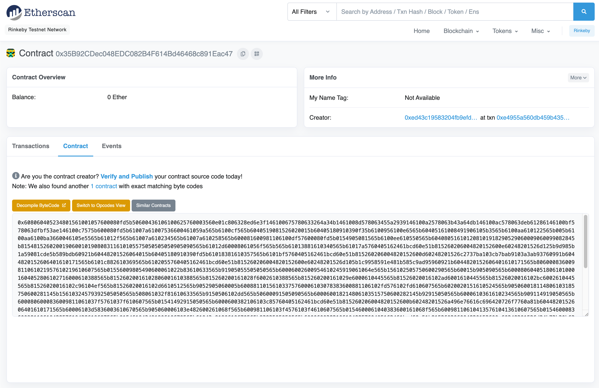
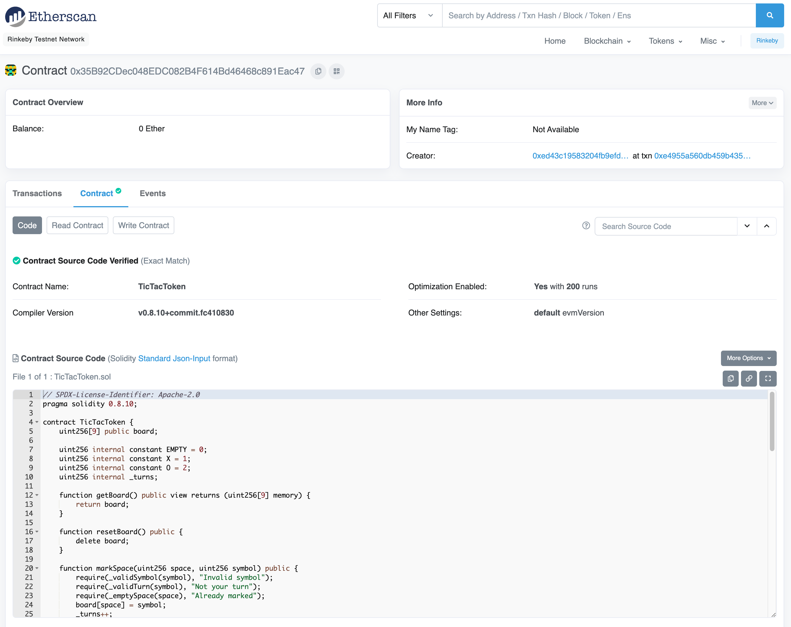

# Verifying the contract

Verifying our contract's source code on Etherscan enables us to read and write data directly from the Etherscan interface. It's considered a good practice to verify public contracts on Etherscan, so that anyone can inspect the underlying contract code.

Before our contract is verified, the "Contract" tab on Etherscan will show the raw bytecode of our contract. Not very helpful to anyone who might want to read and understand it:



To verify our contract, we'll need an Etherscan API key. Create an account at [etherscan.io](https://etherscan.io/) and generate one.

We'll also need to know the exact compiler version used to compile our contract. Figuring this out is kind of a pain, but we can access it by calling the Solidity compiler binary directly. You can find it in a hidden `.svm` directory inside your home directory. In our case, we used version `0.8.10`:

```bash
$ ~/.svm/0.8.10/solc-0.8.10 --version
solc, the solidity compiler commandline interface
Version: 0.8.10+commit.fc410830.Darwin.appleclang
```

We can then use the `forge verify-contract` command to verify our contract on Etherscan:

```bash
$ forge verify-contract --compiler-version v0.8.10+commit.fc410830 \
--chain-id 4 \
0x35B92CDec048EDC082B4F614Bd46468c891Eac47 \
src/TicTacToken.sol:TicTacToken \
<Etherscan API Key>
Submitted contract for verification:
    Response: `OK`
    GUID: `pgrw1kkx9dwencukh8tpd4attlxtq89yftlci9cxghbnxgdvt9`
    url: https://rinkeby.etherscan.io/address/0x35b92cdec048edc082b4f614bd46468c891eac47#code
```

We've passed the exact compiler version we just looked up, the chain ID for the Rinkeby network, the address of our deployed contract, the source file and name of our contract, and our Etherscan API key.

Phew! It's now [verified on Etherscan](https://rinkeby.etherscan.io/address/0x35b92cdec048edc082b4f614bd46468c891eac47#code), where we can see the source code and compiler configuration:



We've taken a long detour with a lot of new tools, but they will all come in handy as we continue to build out our Tic Tac Toe game. Now that we can see our contract on Etherscan, let's explore it a bit.
