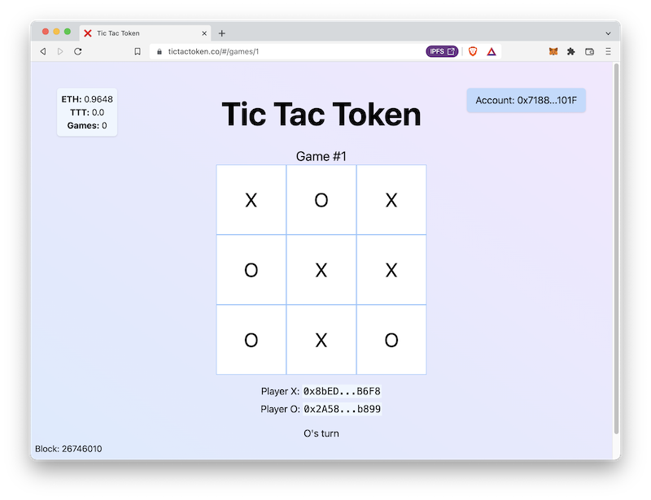

# Introduction

Over the course of this curriculum, we'll learn the basics of Solidity and Ethereum from the ground up and build an interactive web3 Tic-Tac-Toe game. We'll learn about ERC20 tokens, NFTs, and other Ethereum abstractions. Finally we'll deploy our smart contracts to Polygon, an EVM-compatible blockchain with fast, cheap transactions, and host our interactive frontend on IPFS, a distributed peer-to-peer filesystem. 

The content in this book is intended as a supplement to a series of hands on workshops. We typically cover one chapter per week. 

## Prerequisites

You should have some background in programming to get the most out of this content. 

- Read chapters 1-6 of [Mastering Ethereum](https://github.com/ethereumbook/ethereumbook)
- 101 level React: You should be familiar with create-react-app, hooks, structuring an app, and basic testing.
- 102 level automated testing: You should be comfortable writing unit tests and using xUnit style assertions. 
- 102 level UNIX: You should be familiar with Make, bash, and working on the command line.
- 201 level polyglot programming: You've used both a dynamic language like JS/Python and a typed language like Java/Golang.
